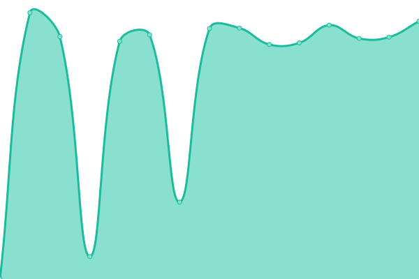
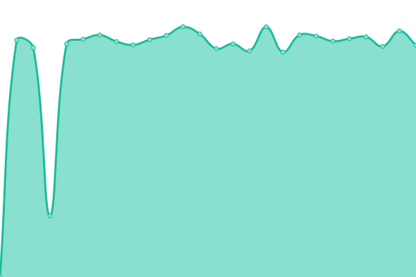
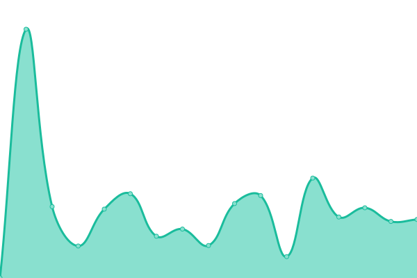
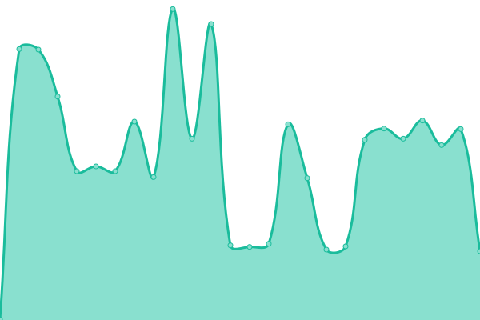
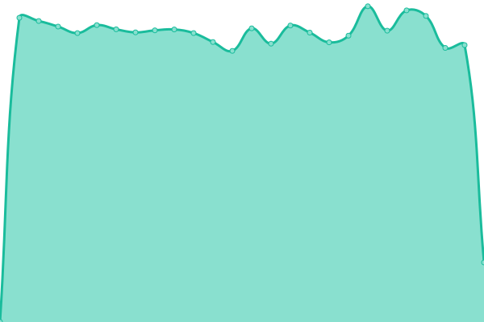
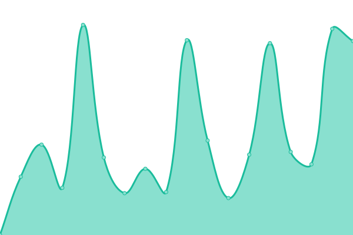
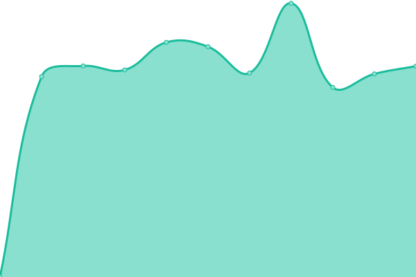
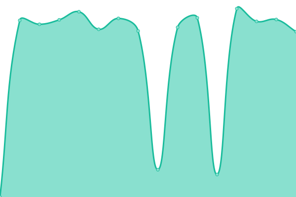
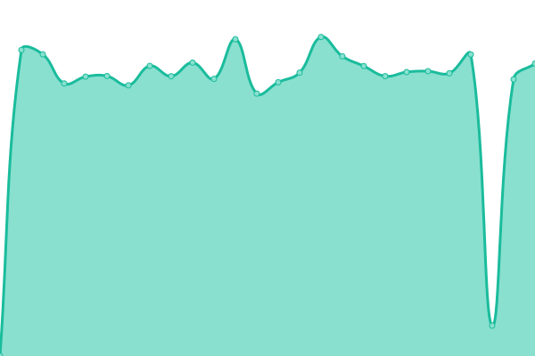
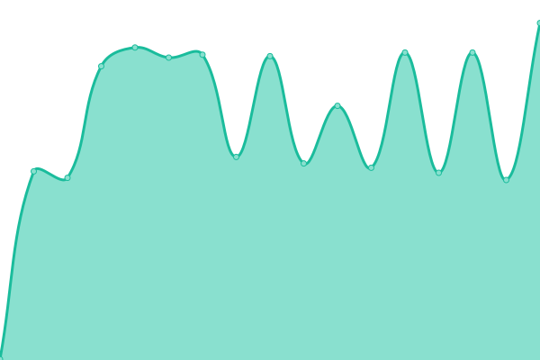

# [📈 Live Status](https://next-franciscocalle.github.io/openweb-uptime-services): <!--live status--> **🟥 Complete outage**

This repository contains the open-source uptime monitor and status page for [Francisco Calle Moreno](https://next-franciscocalle.github.io/openweb-uptime-services), powered by [Upptime](https://github.com/upptime/upptime).

With [Upptime](https://upptime.js.org), you can get your own unlimited and free uptime monitor and status page, powered entirely by a GitHub repository. We use [Issues](https://github.com/next-franciscocalle/openweb-uptime-services/issues) as incident reports, [Actions](https://github.com/next-franciscocalle/openweb-uptime-services/actions) as uptime monitors, and [Pages](https://next-franciscocalle.github.io/openweb-uptime-services) for the status page.

<!--start: status pages-->
<!-- This summary is generated by Upptime (https://github.com/upptime/upptime) -->
<!-- Do not edit this manually, your changes will be overwritten -->
<!-- prettier-ignore -->
| URL | Status | History | Response Time | Uptime |
| --- | ------ | ------- | ------------- | ------ |
|  Openweb Service (PLAY) - Accesses | 🟥 Down | [openweb-service-play-accesses.yml](https://github.com/next-franciscocalle/openweb-uptime-services/commits/HEAD/history/openweb-service-play-accesses.yml) | 

 4670ms
     
 | 

<a href="https://next-franciscocalle.github.io/openweb-uptime-services/history/openweb-service-play-accesses">87.34%</a>
    

|  Openweb Service (PLAY) - Analytics | 🟥 Down | [openweb-service-play-analytics.yml](https://github.com/next-franciscocalle/openweb-uptime-services/commits/HEAD/history/openweb-service-play-analytics.yml) | 

 3604ms
     
 | 

<a href="https://next-franciscocalle.github.io/openweb-uptime-services/history/openweb-service-play-analytics">87.59%</a>
    

|  Openweb Service (PLAY) - Average | 🟥 Down | [openweb-service-play-average.yml](https://github.com/next-franciscocalle/openweb-uptime-services/commits/HEAD/history/openweb-service-play-average.yml) | 

 574ms
     
 | 

<a href="https://next-franciscocalle.github.io/openweb-uptime-services/history/openweb-service-play-average">87.85%</a>
    

|  Openweb Service (PLAY) - CDN | 🟥 Down | [openweb-service-play-cdn.yml](https://github.com/next-franciscocalle/openweb-uptime-services/commits/HEAD/history/openweb-service-play-cdn.yml) | 

 4135ms
     
 | 

<a href="https://next-franciscocalle.github.io/openweb-uptime-services/history/openweb-service-play-cdn">88.10%</a>
    

|  Openweb Service (PLAY) - Comments | 🟥 Down | [openweb-service-play-comments.yml](https://github.com/next-franciscocalle/openweb-uptime-services/commits/HEAD/history/openweb-service-play-comments.yml) | 

 4055ms
     
 | 

<a href="https://next-franciscocalle.github.io/openweb-uptime-services/history/openweb-service-play-comments">88.35%</a>
    

|  Openweb Service (PLAY) - Components | 🟥 Down | [openweb-service-play-components.yml](https://github.com/next-franciscocalle/openweb-uptime-services/commits/HEAD/history/openweb-service-play-components.yml) | 

 3459ms
     
 | 

<a href="https://next-franciscocalle.github.io/openweb-uptime-services/history/openweb-service-play-components">88.60%</a>
    

|  Openweb Service (PLAY) - Computes | 🟥 Down | [openweb-service-play-computes.yml](https://github.com/next-franciscocalle/openweb-uptime-services/commits/HEAD/history/openweb-service-play-computes.yml) | 

 4294ms
     
 | 

<a href="https://next-franciscocalle.github.io/openweb-uptime-services/history/openweb-service-play-computes">88.85%</a>
    

|  Openweb Service (PLAY) - Departments | 🟥 Down | [openweb-service-play-departments.yml](https://github.com/next-franciscocalle/openweb-uptime-services/commits/HEAD/history/openweb-service-play-departments.yml) | 

 3979ms
     
 | 

<a href="https://next-franciscocalle.github.io/openweb-uptime-services/history/openweb-service-play-departments">89.10%</a>
    

|  Openweb Service (PLAY) - Deploys | 🟥 Down | [openweb-service-play-deploys.yml](https://github.com/next-franciscocalle/openweb-uptime-services/commits/HEAD/history/openweb-service-play-deploys.yml) | 

 3272ms
     
 | 

<a href="https://next-franciscocalle.github.io/openweb-uptime-services/history/openweb-service-play-deploys">89.36%</a>
    

|  Openweb Service (PLAY) - Domains | 🟥 Down | [openweb-service-play-domains.yml](https://github.com/next-franciscocalle/openweb-uptime-services/commits/HEAD/history/openweb-service-play-domains.yml) | 

 4139ms
     
 | 

<a href="https://next-franciscocalle.github.io/openweb-uptime-services/history/openweb-service-play-domains">89.61%</a>
    

|  Openweb Service (PLAY) - Dynamo | 🟥 Down | [openweb-service-play-dynamo.yml](https://github.com/next-franciscocalle/openweb-uptime-services/commits/HEAD/history/openweb-service-play-dynamo.yml) | 

 5486ms
     
 | 

<a href="https://next-franciscocalle.github.io/openweb-uptime-services/history/openweb-service-play-dynamo">89.85%</a>
    

|  Openweb Service (PLAY) - Jenkins | 🟥 Down | [openweb-service-play-jenkins.yml](https://github.com/next-franciscocalle/openweb-uptime-services/commits/HEAD/history/openweb-service-play-jenkins.yml) | 

 983ms
     
 | 

<a href="https://next-franciscocalle.github.io/openweb-uptime-services/history/openweb-service-play-jenkins">90.11%</a>
    

|  Openweb Service (PLAY) - Form | 🟥 Down | [openweb-service-play-form.yml](https://github.com/next-franciscocalle/openweb-uptime-services/commits/HEAD/history/openweb-service-play-form.yml) | 

 368ms
     
 | 

<a href="https://next-franciscocalle.github.io/openweb-uptime-services/history/openweb-service-play-form">90.37%</a>
    

|  Openweb Service (PLAY) - Likes | 🟥 Down | [openweb-service-play-likes.yml](https://github.com/next-franciscocalle/openweb-uptime-services/commits/HEAD/history/openweb-service-play-likes.yml) | 

 3686ms
     
 | 

<a href="https://next-franciscocalle.github.io/openweb-uptime-services/history/openweb-service-play-likes">90.62%</a>
    

|  Openweb Service (PLAY) - Most Popular | 🟥 Down | [openweb-service-play-most-popular.yml](https://github.com/next-franciscocalle/openweb-uptime-services/commits/HEAD/history/openweb-service-play-most-popular.yml) | 

 3723ms
     
 | 

<a href="https://next-franciscocalle.github.io/openweb-uptime-services/history/openweb-service-play-most-popular">90.87%</a>
    

|  Openweb Service (PLAY) - Newsletter | 🟥 Down | [openweb-service-play-newsletter.yml](https://github.com/next-franciscocalle/openweb-uptime-services/commits/HEAD/history/openweb-service-play-newsletter.yml) | 

 4160ms
     
 | 

<a href="https://next-franciscocalle.github.io/openweb-uptime-services/history/openweb-service-play-newsletter">91.13%</a>
    

|  Openweb Service (PLAY) - Notifications | 🟥 Down | [openweb-service-play-notifications.yml](https://github.com/next-franciscocalle/openweb-uptime-services/commits/HEAD/history/openweb-service-play-notifications.yml) | 

 1568ms
     
 | 

<a href="https://next-franciscocalle.github.io/openweb-uptime-services/history/openweb-service-play-notifications">91.38%</a>
    

|  Openweb Service (PLAY) - Poll | 🟥 Down | [openweb-service-play-poll.yml](https://github.com/next-franciscocalle/openweb-uptime-services/commits/HEAD/history/openweb-service-play-poll.yml) | 

 3829ms
     
 | 

<a href="https://next-franciscocalle.github.io/openweb-uptime-services/history/openweb-service-play-poll">91.63%</a>
    

|  Openweb Service (PLAY) - Projects | 🟥 Down | [openweb-service-play-projects.yml](https://github.com/next-franciscocalle/openweb-uptime-services/commits/HEAD/history/openweb-service-play-projects.yml) | 

 3919ms
     
 | 

<a href="https://next-franciscocalle.github.io/openweb-uptime-services/history/openweb-service-play-projects">91.88%</a>
    

|  Openweb Service (PLAY) - Proxy | 🟥 Down | [openweb-service-play-proxy.yml](https://github.com/next-franciscocalle/openweb-uptime-services/commits/HEAD/history/openweb-service-play-proxy.yml) | 

 3611ms
     
 | 

<a href="https://next-franciscocalle.github.io/openweb-uptime-services/history/openweb-service-play-proxy">92.14%</a>
    

|  Openweb Service (PLAY) - Roles | 🟥 Down | [openweb-service-play-roles.yml](https://github.com/next-franciscocalle/openweb-uptime-services/commits/HEAD/history/openweb-service-play-roles.yml) | 

 3988ms
     
 | 

<a href="https://next-franciscocalle.github.io/openweb-uptime-services/history/openweb-service-play-roles">92.39%</a>
    

|  Openweb Service (PLAY) - SAML | 🟥 Down | [openweb-service-play-saml.yml](https://github.com/next-franciscocalle/openweb-uptime-services/commits/HEAD/history/openweb-service-play-saml.yml) | 

 3397ms
     
 | 

<a href="https://next-franciscocalle.github.io/openweb-uptime-services/history/openweb-service-play-saml">92.64%</a>
    

|  Openweb Service (PLAY) - Salesforce | 🟥 Down | [openweb-service-play-salesforce.yml](https://github.com/next-franciscocalle/openweb-uptime-services/commits/HEAD/history/openweb-service-play-salesforce.yml) | 

 3206ms
     
 | 

<a href="https://next-franciscocalle.github.io/openweb-uptime-services/history/openweb-service-play-salesforce">92.89%</a>
    

|  Openweb Service (PLAY) - Search | 🟥 Down | [openweb-service-play-search.yml](https://github.com/next-franciscocalle/openweb-uptime-services/commits/HEAD/history/openweb-service-play-search.yml) | 

 3615ms
     
 | 

<a href="https://next-franciscocalle.github.io/openweb-uptime-services/history/openweb-service-play-search">93.14%</a>
    

|  Openweb Service (PLAY) - Statistics | 🟥 Down | [openweb-service-play-statistics.yml](https://github.com/next-franciscocalle/openweb-uptime-services/commits/HEAD/history/openweb-service-play-statistics.yml) | 

 5606ms
     
 | 

<a href="https://next-franciscocalle.github.io/openweb-uptime-services/history/openweb-service-play-statistics">93.39%</a>
    

|  Openweb Service (PLAY) - Tasks | 🟥 Down | [openweb-service-play-tasks.yml](https://github.com/next-franciscocalle/openweb-uptime-services/commits/HEAD/history/openweb-service-play-tasks.yml) | 

 3748ms
     
 | 

<a href="https://next-franciscocalle.github.io/openweb-uptime-services/history/openweb-service-play-tasks">93.64%</a>
    

|  Openweb Service (PLAY) - Users | 🟥 Down | [openweb-service-play-users.yml](https://github.com/next-franciscocalle/openweb-uptime-services/commits/HEAD/history/openweb-service-play-users.yml) | 

 3877ms
     
 | 

<a href="https://next-franciscocalle.github.io/openweb-uptime-services/history/openweb-service-play-users">93.89%</a>
    

|  Openweb Service (PLAY) - Visits | 🟥 Down | [openweb-service-play-visits.yml](https://github.com/next-franciscocalle/openweb-uptime-services/commits/HEAD/history/openweb-service-play-visits.yml) | 

 969ms
     
 | 

<a href="https://next-franciscocalle.github.io/openweb-uptime-services/history/openweb-service-play-visits">94.15%</a>
    

|  Openweb Service (PLAY) - Watermark | 🟥 Down | [openweb-service-play-watermark.yml](https://github.com/next-franciscocalle/openweb-uptime-services/commits/HEAD/history/openweb-service-play-watermark.yml) | 

 353ms
     
 | 

<a href="https://next-franciscocalle.github.io/openweb-uptime-services/history/openweb-service-play-watermark">94.41%</a>
    

<!--end: status pages-->

[**Visit our status website →**](https://next-franciscocalle.github.io/openweb-uptime-services)

## 📄 License

- Powered by: [Upptime](https://github.com/upptime/upptime)
- Code: [MIT](./LICENSE) © [Francisco Calle Moreno](https://next-franciscocalle.github.io/openweb-uptime-services)
- Data in the `./history` directory: [Open Database License](https://opendatacommons.org/licenses/odbl/1-0/)
