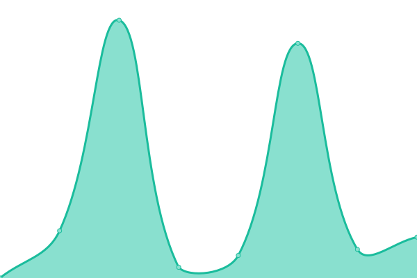

# [📈 Live Status](https://next-franciscocalle.github.io/openweb-uptime-services): <!--live status--> **🟩 All systems operational**

This repository contains the open-source uptime monitor and status page for [Francisco Calle Moreno](https://next-franciscocalle.github.io/openweb-uptime-services), powered by [Upptime](https://github.com/upptime/upptime).

With [Upptime](https://upptime.js.org), you can get your own unlimited and free uptime monitor and status page, powered entirely by a GitHub repository. We use [Issues](https://github.com/next-franciscocalle/openweb-uptime-services/issues) as incident reports, [Actions](https://github.com/next-franciscocalle/openweb-uptime-services/actions) as uptime monitors, and [Pages](https://next-franciscocalle.github.io/openweb-uptime-services) for the status page.

<!--start: status pages-->
<!-- This summary is generated by Upptime (https://github.com/upptime/upptime) -->
<!-- Do not edit this manually, your changes will be overwritten -->
<!-- prettier-ignore -->
| URL | Status | History | Response Time | Uptime |
| --- | ------ | ------- | ------------- | ------ |
|  [Panel de Openweb](https://webpublicas.bbva.com/) | 🟩 Up | [panel-de-openweb.yml](https://github.com/BBVA-Openweb/uptime-services/commits/HEAD/history/panel-de-openweb.yml) | 

 584ms
     
 | 

<a href="https://status.openweb.bbva/history/panel-de-openweb">100.00%</a>
    

|  Openweb Service - Accesses | 🟩 Up | [openweb-service-accesses.yml](https://github.com/BBVA-Openweb/uptime-services/commits/HEAD/history/openweb-service-accesses.yml) | 

 2096ms
     
 | 

<a href="https://status.openweb.bbva/history/openweb-service-accesses">100.00%</a>
    

|  Openweb Service - Analytics | 🟩 Up | [openweb-service-analytics.yml](https://github.com/BBVA-Openweb/uptime-services/commits/HEAD/history/openweb-service-analytics.yml) | 

 2252ms
     
 | 

<a href="https://status.openweb.bbva/history/openweb-service-analytics">100.00%</a>
    

|  Openweb Service - Average | 🟩 Up | [openweb-service-average.yml](https://github.com/BBVA-Openweb/uptime-services/commits/HEAD/history/openweb-service-average.yml) | 

 488ms
     
 | 

<a href="https://status.openweb.bbva/history/openweb-service-average">100.00%</a>
    

|  Openweb Service - CDN | 🟩 Up | [openweb-service-cdn.yml](https://github.com/BBVA-Openweb/uptime-services/commits/HEAD/history/openweb-service-cdn.yml) | 

 2520ms
     
 | 

<a href="https://status.openweb.bbva/history/openweb-service-cdn">100.00%</a>
    

|  Openweb Service - Comments | 🟩 Up | [openweb-service-comments.yml](https://github.com/BBVA-Openweb/uptime-services/commits/HEAD/history/openweb-service-comments.yml) | 

 630ms
     
 | 

<a href="https://status.openweb.bbva/history/openweb-service-comments">100.00%</a>
    

|  Openweb Service - Components | 🟩 Up | [openweb-service-components.yml](https://github.com/BBVA-Openweb/uptime-services/commits/HEAD/history/openweb-service-components.yml) | 

 438ms
     
 | 

<a href="https://status.openweb.bbva/history/openweb-service-components">100.00%</a>
    

|  Openweb Service - Computes | 🟩 Up | [openweb-service-computes.yml](https://github.com/BBVA-Openweb/uptime-services/commits/HEAD/history/openweb-service-computes.yml) | 

 1711ms
     
 | 

<a href="https://status.openweb.bbva/history/openweb-service-computes">100.00%</a>
    

|  Openweb Service - Departments | 🟩 Up | [openweb-service-departments.yml](https://github.com/BBVA-Openweb/uptime-services/commits/HEAD/history/openweb-service-departments.yml) | 

 2468ms
     
 | 

<a href="https://status.openweb.bbva/history/openweb-service-departments">100.00%</a>
    

|  Openweb Service - Deploys | 🟩 Up | [openweb-service-deploys.yml](https://github.com/BBVA-Openweb/uptime-services/commits/HEAD/history/openweb-service-deploys.yml) | 

 1463ms
     
 | 

<a href="https://status.openweb.bbva/history/openweb-service-deploys">100.00%</a>
    

|  Openweb Service - Domains | 🟩 Up | [openweb-service-domains.yml](https://github.com/BBVA-Openweb/uptime-services/commits/HEAD/history/openweb-service-domains.yml) | 

 3086ms
     
 | 

<a href="https://status.openweb.bbva/history/openweb-service-domains">100.00%</a>
    

|  Openweb Service - Dynamo | 🟩 Up | [openweb-service-dynamo.yml](https://github.com/BBVA-Openweb/uptime-services/commits/HEAD/history/openweb-service-dynamo.yml) | 

 349ms
     
 | 

<a href="https://status.openweb.bbva/history/openweb-service-dynamo">100.00%</a>
    

|  Openweb Service - Jenkins | 🟩 Up | [openweb-service-jenkins.yml](https://github.com/BBVA-Openweb/uptime-services/commits/HEAD/history/openweb-service-jenkins.yml) | 

 753ms
     
 | 

<a href="https://status.openweb.bbva/history/openweb-service-jenkins">100.00%</a>
    

|  Openweb Service - Form | 🟩 Up | [openweb-service-form.yml](https://github.com/BBVA-Openweb/uptime-services/commits/HEAD/history/openweb-service-form.yml) | 

 431ms
     
 | 

<a href="https://status.openweb.bbva/history/openweb-service-form">100.00%</a>
    

|  Openweb Service - Likes | 🟩 Up | [openweb-service-likes.yml](https://github.com/BBVA-Openweb/uptime-services/commits/HEAD/history/openweb-service-likes.yml) | 

 419ms
     
 | 

<a href="https://status.openweb.bbva/history/openweb-service-likes">100.00%</a>
    

|  Openweb Service - Most Popular | 🟩 Up | [openweb-service-most-popular.yml](https://github.com/BBVA-Openweb/uptime-services/commits/HEAD/history/openweb-service-most-popular.yml) | 

 434ms
     
 | 

<a href="https://status.openweb.bbva/history/openweb-service-most-popular">100.00%</a>
    

|  Openweb Service - Newsletter | 🟩 Up | [openweb-service-newsletter.yml](https://github.com/BBVA-Openweb/uptime-services/commits/HEAD/history/openweb-service-newsletter.yml) | 

 3135ms
     
 | 

<a href="https://status.openweb.bbva/history/openweb-service-newsletter">100.00%</a>
    

|  Openweb Service - Notifications | 🟩 Up | [openweb-service-notifications.yml](https://github.com/BBVA-Openweb/uptime-services/commits/HEAD/history/openweb-service-notifications.yml) | 

 575ms
     
 | 

<a href="https://status.openweb.bbva/history/openweb-service-notifications">100.00%</a>
    

|  Openweb Service - Poll | 🟩 Up | [openweb-service-poll.yml](https://github.com/BBVA-Openweb/uptime-services/commits/HEAD/history/openweb-service-poll.yml) | 

 2717ms
     
 | 

<a href="https://status.openweb.bbva/history/openweb-service-poll">100.00%</a>
    

|  Openweb Service - Projects | 🟩 Up | [openweb-service-projects.yml](https://github.com/BBVA-Openweb/uptime-services/commits/HEAD/history/openweb-service-projects.yml) | 

 1423ms
     
 | 

<a href="https://status.openweb.bbva/history/openweb-service-projects">100.00%</a>
    

|  Openweb Service - Proxy | 🟩 Up | [openweb-service-proxy.yml](https://github.com/BBVA-Openweb/uptime-services/commits/HEAD/history/openweb-service-proxy.yml) | 

 1000ms
     
 | 

<a href="https://status.openweb.bbva/history/openweb-service-proxy">100.00%</a>
    

|  Openweb Service - Roles | 🟩 Up | [openweb-service-roles.yml](https://github.com/BBVA-Openweb/uptime-services/commits/HEAD/history/openweb-service-roles.yml) | 

 3028ms
     
 | 

<a href="https://status.openweb.bbva/history/openweb-service-roles">100.00%</a>
    

|  Openweb Service - SAML | 🟩 Up | [openweb-service-saml.yml](https://github.com/BBVA-Openweb/uptime-services/commits/HEAD/history/openweb-service-saml.yml) | 

 2709ms
     
 | 

<a href="https://status.openweb.bbva/history/openweb-service-saml">100.00%</a>
    

|  Openweb Service - Salesforce | 🟩 Up | [openweb-service-salesforce.yml](https://github.com/BBVA-Openweb/uptime-services/commits/HEAD/history/openweb-service-salesforce.yml) | 

 2388ms
     
 | 

<a href="https://status.openweb.bbva/history/openweb-service-salesforce">100.00%</a>
    

|  Openweb Service - Search | 🟩 Up | [openweb-service-search.yml](https://github.com/BBVA-Openweb/uptime-services/commits/HEAD/history/openweb-service-search.yml) | 

 393ms
     
 | 

<a href="https://status.openweb.bbva/history/openweb-service-search">100.00%</a>
    

|  Openweb Service - Statistics | 🟩 Up | [openweb-service-statistics.yml](https://github.com/BBVA-Openweb/uptime-services/commits/HEAD/history/openweb-service-statistics.yml) | 

 2376ms
     
 | 

<a href="https://status.openweb.bbva/history/openweb-service-statistics">100.00%</a>
    

|  Openweb Service - Tasks | 🟩 Up | [openweb-service-tasks.yml](https://github.com/BBVA-Openweb/uptime-services/commits/HEAD/history/openweb-service-tasks.yml) | 

 1491ms
     
 | 

<a href="https://status.openweb.bbva/history/openweb-service-tasks">100.00%</a>
    

|  Openweb Service - Users | 🟩 Up | [openweb-service-users.yml](https://github.com/BBVA-Openweb/uptime-services/commits/HEAD/history/openweb-service-users.yml) | 

 2537ms
     
 | 

<a href="https://status.openweb.bbva/history/openweb-service-users">100.00%</a>
    

|  Openweb Service - Watermark | 🟩 Up | [openweb-service-watermark.yml](https://github.com/BBVA-Openweb/uptime-services/commits/HEAD/history/openweb-service-watermark.yml) | 

 350ms
     
 | 

<a href="https://status.openweb.bbva/history/openweb-service-watermark">100.00%</a>
    

<!--end: status pages-->

[**Visit our status website →**](https://next-franciscocalle.github.io/openweb-uptime-services)

## 📄 License

- Powered by: [Upptime](https://github.com/upptime/upptime)
- Code: [MIT](./LICENSE) © [Francisco Calle Moreno](https://next-franciscocalle.github.io/openweb-uptime-services)
- Data in the `./history` directory: [Open Database License](https://opendatacommons.org/licenses/odbl/1-0/)
